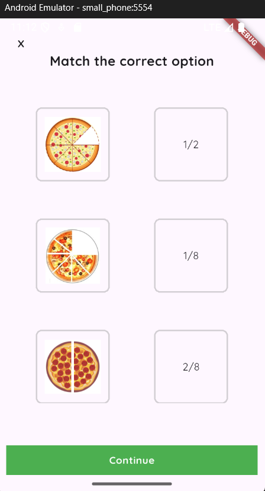

# Flutter Project Demo App

## 🛠️ Tech Stack  
- **Framework:** Flutter  
- **Programming Language:** Dart 

## Getting Started

# Clone the repository
git clone https://github.com/username/flutter-kids-mobile-app.git

# Navigate to the project folder
cd flutter-kids-mobile-app

# Get dependencies
flutter pub get

# Run on emulator or device
flutter run
